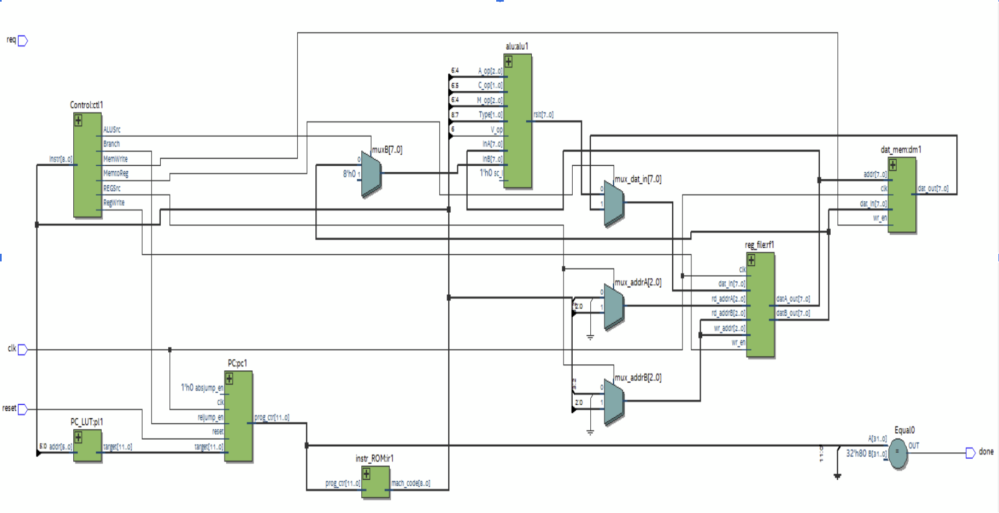
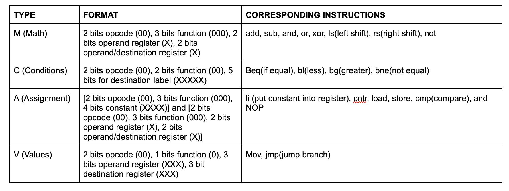
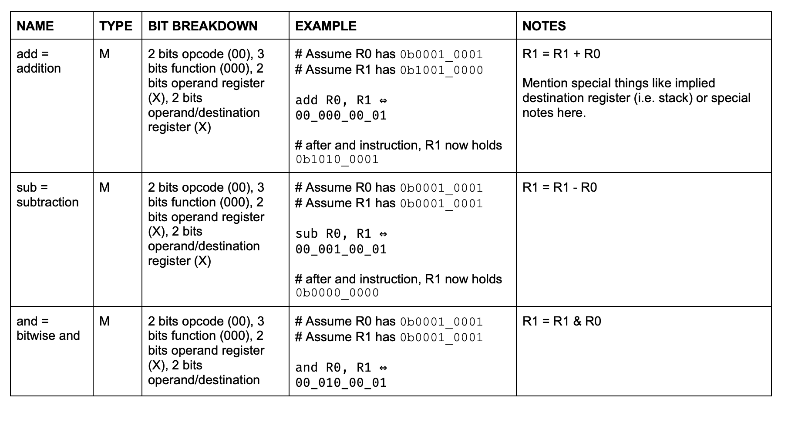
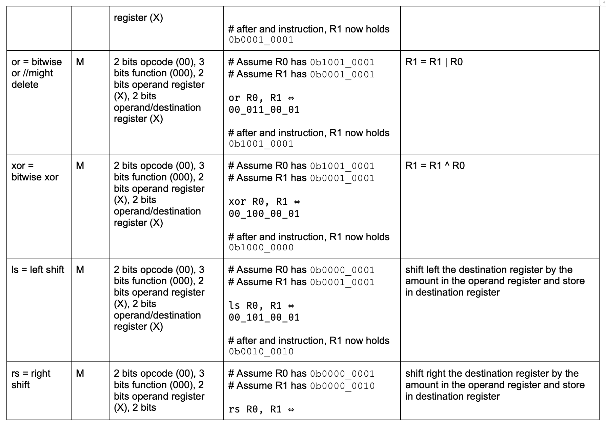
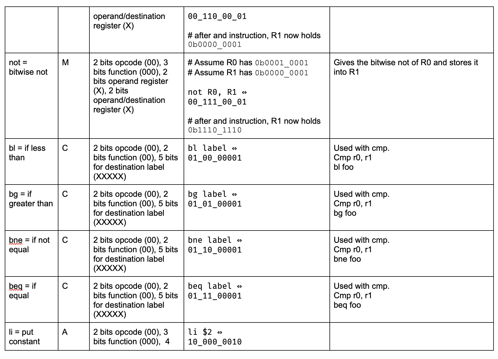
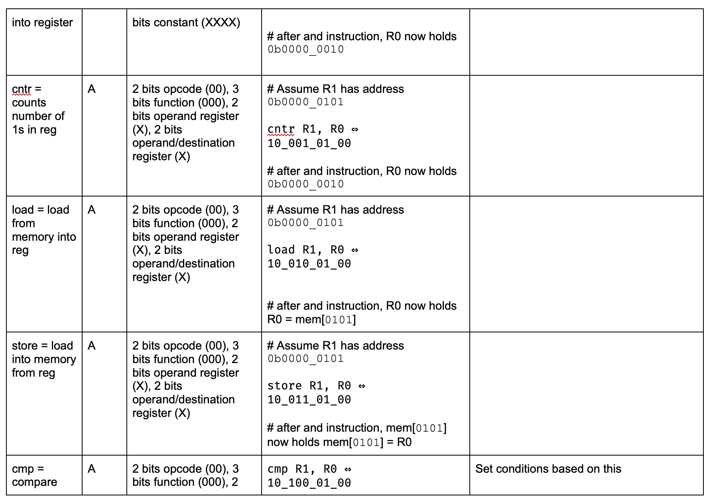
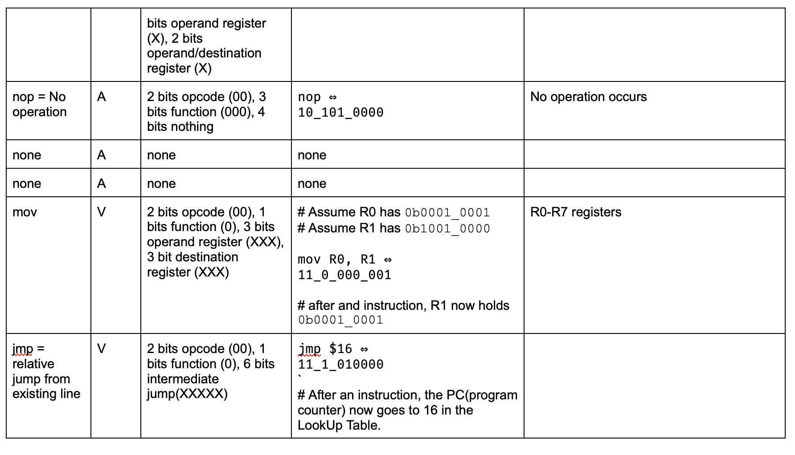

# MCAV-9-Processor

0. # Introduction

The architecture name is MCAV-9 Processor. Our overall philosophy is creating CPU architecture that is more based on the architecture of that of MIPS. Specific goals we strive to achieve is that our CPU will be able to compute the three programs. Our machine would be classified as a register-register/load-store machine. 

1. #  Architectural Overview

[]

2. #  Machine Specification
## Instruction formats

[]

## Operations
[]
[]
[]
[]
[]

## Internal Operands
There are 8 registers however many operations only require the first four registers to compute. The last four registers can be accessed using mov to mov them into register r0 - r3 or move r0-r3 in the other registers.
## Control Flow (branches)
Jmp, Beq(if equal), bl(less), bg(greater), bne(not equal), ble(less than equal), bge(greater than equal) branches. The maximum jump distance is 31 lines relative to the current position. We accommodate for large jumps by jumping multiple times and using nops and also using labels for the other branches.
## Addressing Modes

Memory addressing modes are both direct and indirect. We can use load = load word from stack into reg and store = store word from reg in stack for indirect. For direct we have, lm = load from memory using address into reg and sm = load into memory from reg using address. Addresses are calculated by offsetting the base address.

3. #  Programmer's Model [Lite]
3\.1: The programmer should think that our machine operates similar to that one of MIPS architecture. The general strategy a programmer should follow when writing programs for our machine is to use the first 4 registers for computation and the last 4 registers for holding values when needed.

3\.2: Can we copy the instructions/operation from MIPS or ARM ISA? If no, explain why not? How did you overcome this or how do you deal with this in your current design? Word limit: 100 words.

`	`We can’t copy the instructions straight from MIPS or ARM ISA because they use 32 bits. We looked at the MIPS architecture and drew inspiration from it to create functions and operations that are 9 bit wide. We created 4 different types and those 4 different types have different functions and can access different amounts of registers. This was the most challenging part. 

3\.3: Will your ALU be used for non-arithmetic instructions (e.g., MIPS or ARM-like memory address pointer calculations, PC relative branch computations, etc.)? If so, how does that complicate your design?

`	`Yes. Our ALU is split up into 4 sections, one section dealing with Arithmetic instructions, one dealing with conditions, one dealing with assignment, and one dealing with values. Branch computations are included in the Value type, as well as memory address pointer calculations in the condition and assignment types. These calculations are similar in the fact that they’re mathematical operations, but they’re moreso exceptions that do not fit into direct arithmetic operations but they still rely on some type of math process. We planned to use the compare instruction for branches but we have been having trouble implementing it as of Milestone 2. 